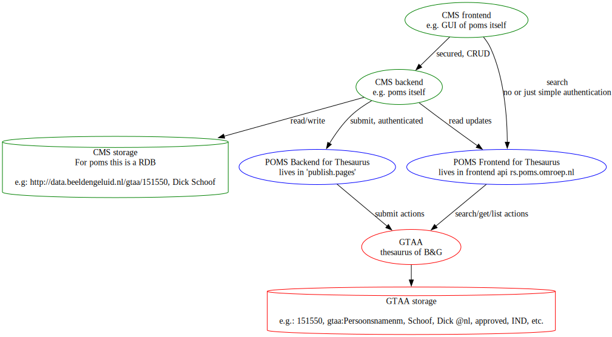

= Common Thesaurus for AudioVisual Archives (GTAA)
:toc:

This contains the 'openskos' client implementation of the link:https://www.beeldengeluid.nl/onderzoek/onderzoek/kennisthemas/metadata/gemeenschappelijke-thesaurus-audiovisuele-archieven[GTAA repository].

So this code produces the specific implementation of link:https://github.com/npo-poms/poms-shared/blob/main/gtaa-domain/src/main/java/nl/vpro/domain/gtaa/GTAARepository.java[GTAARepository]

== Axes

GTAA provides several axes ('schemes') of information. POMS uses several of them, but the must important one is the persons.

Every concept has its own unique 'gtaa id'.

The repository provides methods to

- Find persons or information from other schemes, in the GTAA of Beeld en Geluid.
- For some use cases it is important to sync data from the GTAA to your local database or so. Poms uses the several 'update' calls to inspect all changes and see if something needs change in its own database.
- It is also possible to submit new concepts to the GTAA in case one is missing.

== Frontend code

Beeld en Geluid does not provide a frontend. The poms team made something and this is used in both poms, and can also be used in other applications.

See https://github.com/npo-poms/thesaurus

== About OpenSKOS

It seems that 'open skos' (Used to be at http://openskos.org/) does not exist anymore. BENG did rewrite it, and this required only minor changes on the client side.

== All together

The relations of the different relevant services are shown in this picture

green elements::
System just for the sake of illustration. POMS itself is example because
- It refers to thesaurus by gtaa-urls. For persons, but some other schemes are supported to (see poms gui)
- It may periodically check for updates, e.g. the gtaa status may change or so, and this needs update in its own database

Another green element could also be the link:https://rs.poms.omroep.nl/v1/thesaurus/example/[example page]

blue elements::
These are
- link:https://rs.poms.omroep.nl/v1/docs/api/#/[the thesaurus endpoints on the poms frontend api]
- link:https://publish.pages.omroep.nl/docs/api/#/thesaurus[the thesaurus endpoint on the poms pages api]

This first one proxies the read endpoint on the thesaurus.
The second one proxies the write endpoints. It is on the 'publish.pages.omroep.nl' domain, for no particular good reason but:

- because it is not (directly) related to media
- it is secured by backend accounts

red elements::
This represents the services of B&G itself. The api is secured by just one account for POMS.

== URLS

=== Productie

https://gtaa.apis.beeldengeluid.nl/ Gives an overview.

=== Test

There is no test-environment nowadays.

=== Acceptatie

https://skos-acc.beeldengeluid.nl/

`
